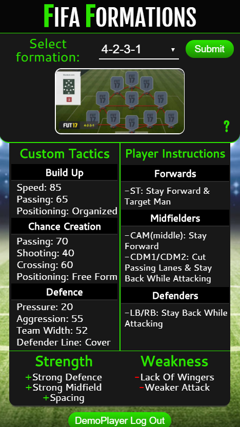

<h1>Fifa Formations</h1>

<h2>Summary</h2>

<a href="https://fifaformations.netlify.com">Fifa Formations</a> is an easy to use quick reference quide for FIFA FUT formations.

I have been playing FIFA for over a decade and wanted to make something that incorporated it.  This helps you to set up your team with ease and get more wins

The information was found from popular FIFA youtubers like Ovvy, Dirty Mike, DMG and I tweaked some as well.

<h2>API</h2>

Fifa formations uses an original api retrieving data from a mongo database that I created.

The api can be found<a href="https://github.com/SMuyesser/fifaformations-api"> here</a>.

<h2>Images</h2>

  
  

<h2>Technology</h2>
<h3>Front End</h3>
<ul>
  <li>HTML5</li>
  <li>CSS3</li>
  <li>JavaScript</li>
  <li>React</li>
  <li>Redux</li>
  <li>React Router</li>
</ul>
<h3>Fully Responsive for all devices</h4>
<h3>Back End</h3>
<ul>
  <li>Node.js + Express.js (web server)</li>
  <li>MongoDB (database)</li>
  <li>Mongoose</li>
  <li><a href="https://mochajs.org/">Mocha</a> + <a href="http://chaijs.com/">Chai</a> (testing)</li>
  <li>Enzyme (testing)</li>
  <li>Continuous integration and deployment with <a href="https://travis-ci.org/">Travis CI</a></li>
</ul>
